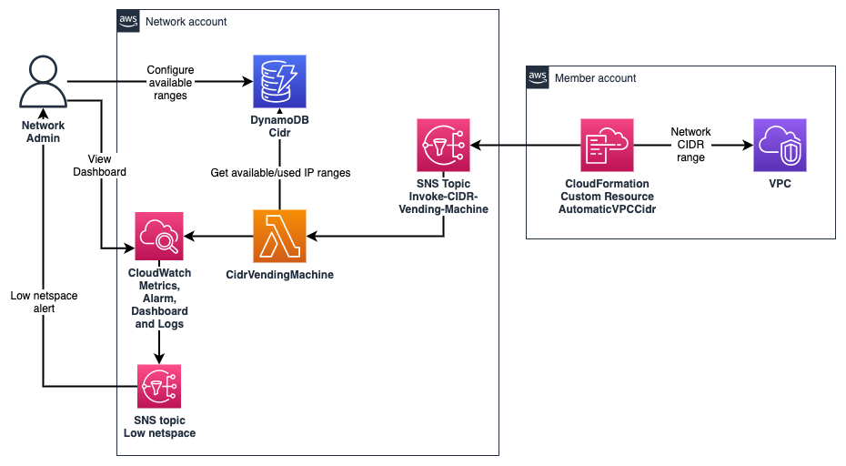

## IPAM - VPC CIDR Vending Machine

This project contains AWS CloudFormation templates and Python code to automaticaly vend CIDR blocks to VPC CloudFormation templates that uses the given Custom Resource.

This IPAM, called the VPC CIDR vending machine, uses a DynamoDB table to keep track of CIDR ranges that are available and used, as well as an SNS topic (that can be called from CloudFormation) to trigger a Lambda to get a CIDR range that is available on CREATE, or release the CIDR range if the resource is DELETEd.

The solution provides an SNS backed Custom CloudFormation resource that returns a CIDR string, which can be used by the VPC Service Catalog Product/CloudFormation template. The custom resource also optionally accepts a static CIDR, which is then checked to see if it is available in the pool.

There is no UI for the IPAM, the available supernet(s) entry is inserted as a JSON item manually into the DynamoDB table as a one time activity. The IPAM then caculates, inserts and removes "USED" entries in the DynamoDB table as required. It writes metrics on the number of used entries, and the number of potential networks that can be vended from the available network space.

The following dashboard is available via [CloudWatch Dashboards](https://docs.aws.amazon.com/AmazonCloudWatch/latest/monitoring/CloudWatch_Dashboards.html) to monitor the CIDR vending status and actions:


The SNS topic can be kept in the networking account, and has a policy to allow it to be called by CloudFormation for any account in the AWS Organization. The SNS topic calls a Python Lambda function that uses the DynamoDB table to get an available CIDR, and mark it as “USED”. If the custom resource is deleted, the CIDR is marked as available again.

You can also mark a CIDR as ALLOCATED, which means it is not vended automatically, but is allowed if that CIDR is specifically requested.

This is the diagram of the IPAM solution:



Several instances of this solution can be instantiated to have separate pools, for example separate pools for production and non-production CIDRs.

To use the solution, your current VPC template can be modified to include this custom resource, which returns a CIDR range that can be used by the AWS::EC2::VPC resource:

```yaml
Parameters:
  Environment:
    Description: Environment
    Type: String
    AllowedValues:
      - nonprod
      - prod

  VPCName:
    Description: VPC Name
    Type: String

  CIDRPrefix:
    Description: VPC prefix/size
    Type: Number
    Default: 24
    AllowedValues:
      - 24
      - 22
      - 20

  VPCNetwork:
    Description: Network (WITHOUT the /prefix) to assign to the created VPC, eg. 10.123.0.0 . Set to Automatic to get a unique network range.
    Type: String
    Default: Automatic
    AllowedPattern: ^((\d{1,3})\.(\d{1,3})\.(\d{1,3})\.(\d{1,3})|Automatic)$

Conditions:
  UserDefinedCidr: !Not [ !Equals [ !Ref VPCNetwork, 'Automatic' ] ]

Mappings:
  Variables:
    NetworkAccountID:
      Value: "123456789012"

Resources:
  VpcCidr:
    Type: Custom::VpcCidrVender
    Properties:
      ServiceToken: !Sub 
        - arn:aws:sns:${AWS::Region}:${NetworkAccountID}:CIDR-Vending-Machine-${Environment}
        - NetworkAccountID: !FindInMap [ Variables, NetworkAccountID, Value ]
      SubnetMask: !Ref SubnetMask
      VpcName: !Ref VPCName
      RequestNetwork: !If [ UserDefinedCidr, !Ref VPCNetwork, !Ref AWS::NoValue ]

  VPC:
    Type: AWS::EC2::VPC
    Properties:
      CidrBlock: !Ref VpcCidr  # <-------------
      Tags:
          - Key: Name
            Value: !Sub ${VPCName}

  ...            

```


# Installation/update:

_(if you are upgrading from the old version that needed a preallocation of every CIDR, see Upgrade Notes below)_

- The installation can be done in AWS CloudShell with Python 3.11 installed. To install Python 3.11 in CloudShell, run:

```
sudo amazon-linux-extras enable python3.11
sudo yum -y install python3.11
```

- A separate instance of the IPAM solution is created per "pool" or environment. To create or update a pool/environment, run: `./install.sh <pool name> <optional alert email 1> <optional alert email 2> <optional alert email 3>`. For example:

```bash
./install.sh sandbox my@email.com
```

New pools can be added by running the command with a different pool name. 

- The DynamoDB table needs to be populated with the available IP supernet, one item per supernet that can be allocated:

```json
{
  "cidr": "10.113.0.0/16",
  "allocation_status": "ap-southeast-2:AVAILABLE",
  "subnet_mask": 16
}
```

- **cidr**: (string) The CIDR supernet to allocate IPs from, for example 10.113.0.0/16.

- **subnet_mask**: (integer) The subnet mask, for example 16.

- **allocation_status**, set to AVAILABLE or ALLOCATED, prefixed with the region name, for example ap-southeast-2:AVAILABLE.

Either use the Management Console DynamoDB page, or the AWS CLI to insert the above item. To insert this item with the AWS CLI, use (replace the pool name, cidr, region and subnet_mask):

```bash
aws dynamodb put-item \
  --table-name Cidrs-mypoolname \  # <---- replace pool name
  --item '
      {
        "cidr": {
          "S": "10.113.0.0/16"  <------ replace CIDR
        },
        "allocation_status": {
          "S": "ap-southeast-2:AVAILABLE"  <---- replace region
        },
        "subnet_mask": {
          "N": "16"               <----- replace subnet
        }
      }
  '

```

- To test the resource, go to the `sample-resource/` directory, and create the `VPC-Cidr-Test.yml` template on a non-network (eg. sandpit) account. This does not create a VPC, but rather an SSM parameter just outputing the CIDR. After a CIDR gets allocated, within 5-10 minutes the CloudWatch dashboard should be populated as well.


If you want to quickly see how the IPAM allocates CIDRs, you can test the solution locally on your machine, using DynamoDB local. See [tests/README.md](tests/README.md).


# Upgrade notes

If you are upgrading from the old version that needed a preallocation of every CIDR, back up your existing DDB table, and run the `upgrade_old_DDB.py` script with a `--table Cidrs-yourpool` argument. This deletes all the old AVAILBLE entries. You then need to add the supernet entry/entries into DDB as decribed above.

# Author
- Rizvi Rahim
- Mark Gu
- Cheng Wang

## License

This library is licensed under the MIT-0 License. See the LICENSE file.